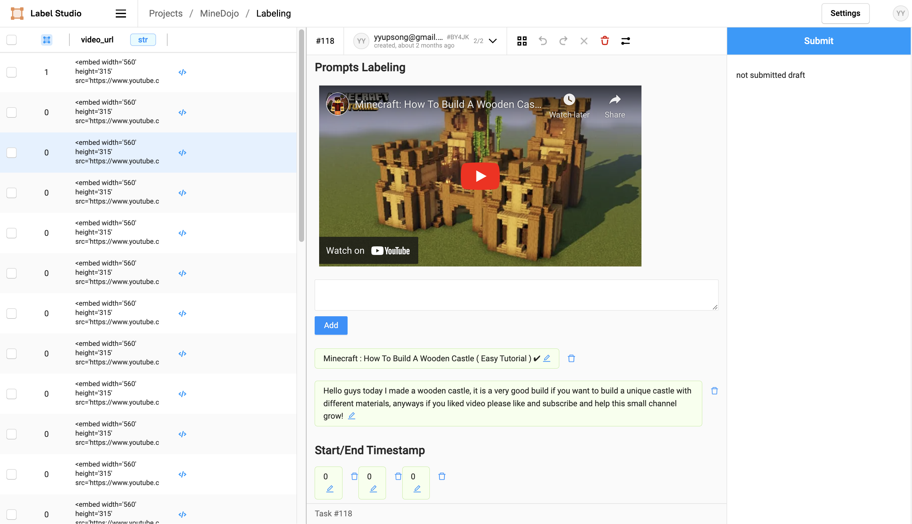
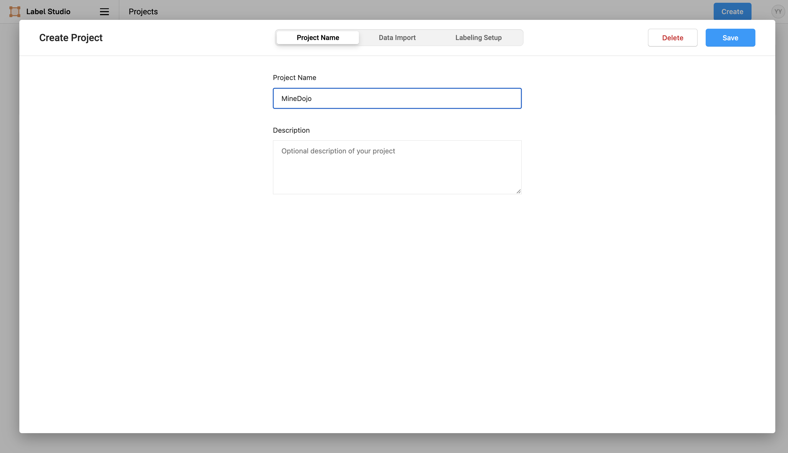
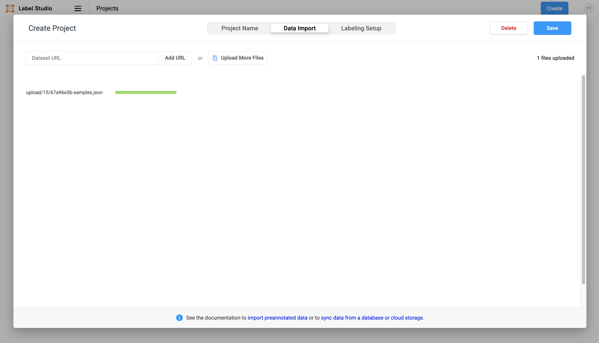
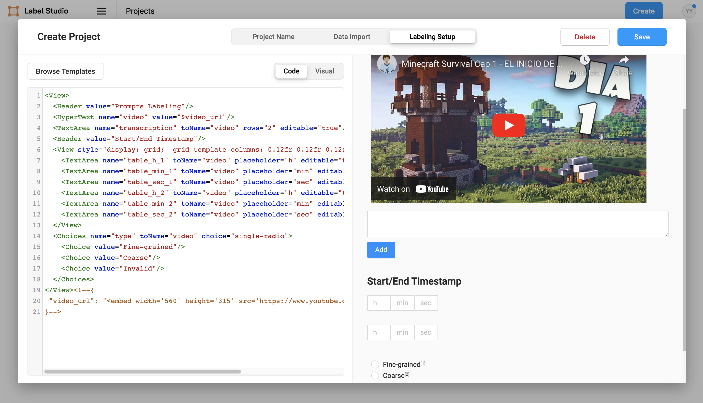
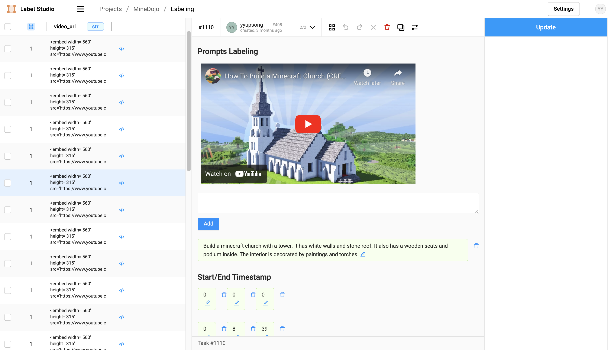
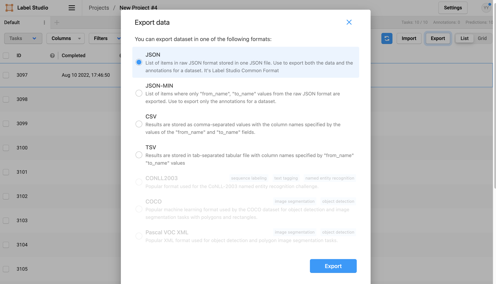

# Labeling UI for Creative Tasks in MineDojo
<div align="center">

[[Website]](https://minedojo.org)
[[Arxiv Paper]](https://arxiv.org/abs/2206.08853)
[[PDF]](https://arxiv.org/pdf/2206.08853.pdf)
[[MineDojo]](https://github.com/MineDojo/MineDojo)
[[Open Database]](https://minedojo.org/knowledge_base)
[[Team]](https://minedojo.org/index.html#team)

[](https://pypi.org/project/MineDojo/)
[](https://github.com/MineDojo/TaskCreationUI/blob/main/LICENSE)
______________________________________________________________________
</div>



We identify our [YouTube dataset](https://minedojo.org/knowledge_base.html) as a rich source of tasks, as many human players demonstrate and narrate creative missions in the tutorial playlists. To collect high-quality tasks and accompanying videos, we design a pipeline that makes it easy to find and annotate interesting tasks (see our [Arxiv paper](https://arxiv.org/abs/2206.08853) for details). We design a task curation UI using [Label Studio](https://labelstud.io/) that displays the full video and YouTube description. A human annotator can choose to reject the video, adjust the timestamps, select the title, or refine the description to be the task goal. Through this pipeline, we extract more than 1,000 tasks from the common wisdom of a huge number of veteran Minecraft gamers. Some examples are "make an automated mining machine" and "grow cactus up to the sky".

# Installation
```
pip install label-studio
```
# Setup
```
label-studio start
```
Sign up and log in label studio. 

There are three steps to set up your first labeling project:
1. Name your project
2. Import data
3. Specify template for Labeling UI

## Step 1: Name Your Project
Name your project and add description to it.


## Step 2: Data Import
Import `samples.json` as an example. It contains 10 data samples. The imported file should be a json file and you can follow the format of this example file if you need to customize your own dataset.


## Step 3: Labeling UI Template
Select "Custom template" in Labeling Setup and paste `template.html` into it. Click "Save" to create the project.


# Annotation
This screenshot is an example of the annotation UI. We use pre-annotated data (video title and description) as a suggestion for labeling. You can choose to reject the video, adjust the timestamps, select the title, or refine the description to be the task goal. Click "Submit" to record your annotation.


# Data Export
You can export the annotated data in any format to your local storage.


# Learn More

Please check out Label Studio's [official website](https://labelstud.io/) for more information!

# Paper and Citation

Our paper is posted on [Arxiv](https://arxiv.org/abs/2206.08853). If you find our work useful, please consider citing us! 

```bibtex
@article{fan2022minedojo,
  title   = {MineDojo: Building Open-Ended Embodied Agents with Internet-Scale Knowledge},
  author  = {Linxi Fan and Guanzhi Wang and Yunfan Jiang and Ajay Mandlekar and Yuncong Yang and Haoyi Zhu and Andrew Tang and De-An Huang and Yuke Zhu and Anima Anandkumar},
  year    = {2022},
  journal = {arXiv preprint arXiv: Arxiv-2206.08853}
}
```

